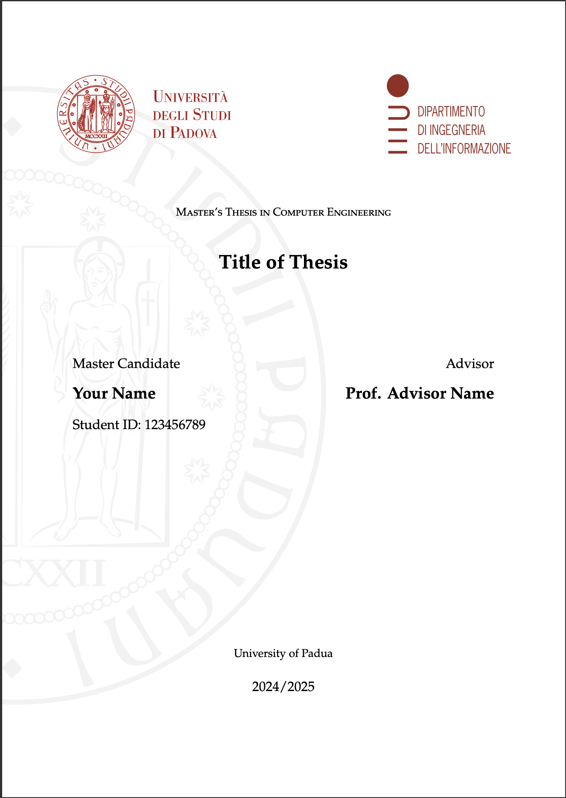
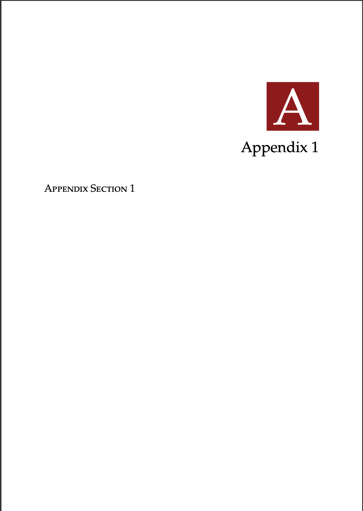

# Thesis Template – DEI, University of Padua 

A clean and customizable LaTeX template for Master's theses at the **Department of Information Engineering (DEI)**, University of Padua.  
Designed to comply with the department's formatting guidelines, this template simplifies the writing process and ensures professional presentation.

## Template Structure

The project is organized into clearly separated components to make editing and compilation easy:

```text
.
├── DEIthesis.cls 
├── appendices
│   ├── appendix1.tex
│   └── code_listings.tex
├── chapters
│   ├── 01_introduction.tex
│   └── 02_conclusion.tex
├── code
├── frontmatter
│   ├── abstract.tex
│   └── thanks.tex
├── main.tex
├── references.bib
└── res
    ├── dei.pdf
    ├── ltunipd.pdf
    ├── unipd.pdf
    └── unipdbg.pdf
```

## Getting Started

This template is designed for both local compilation and use with Overleaf.

### 1. Fill in Your Information

Begin by editing the following files to personalize the template:

- `frontmatter/abstract.tex`  
  → Write your thesis abstract.

- `frontmatter/thanks.tex`  
  → Add acknowledgments or leave it empty if not used.

- `main.tex`  
  → This is the main compilation file. Set your thesis metadata in the preamble:
 
```latex
\title{Title of Thesis}
\author{Your Name}
\studentId{123456789}
\advisor{Prof. Advisor Name}
\university{University of Padua}
\mastername{Computer Engineering}
\academicYear{2024/2025}
``` 
These commands are defined in `DEIthesis.cls`, and you can add or modify them there if needed.

### 2. Add Your Content
The thesis body is divided into chapters and appendices.

- Chapters go in the `chapters/` folder:
Start with `01_introduction.tex` and add more files (e.g., `02_background.tex`, etc.)
- Appendices go in the `appendices/` folder:
Use `appendix1.tex` for general appendices and `code_listings.tex` if including code.
- Codes go in the `code/` folder: Add your scripts there.

### 3. Add Your Bibliography

- Use the `references.bib` file to manage citations.
- Use `\parencite{}` in your chapters to reference bibliography entries.

> ⚠ **Compiler Notice**  
> This template is designed to work with **XeLaTeX** (preferred) or **LuaLaTeX**.  
> It **will not compile** correctly with PDFLaTeX due to font and Unicode dependencies.


## Preview

### Cover Page Preview


### Chapters Preview


### Appendix Preview


### Code Preview


## License
This project is licensed under the MIT License.
Feel free to use, modify, and share it with attribution.

## Acknowledgments
This template was developed based on formatting needs of DEI students at the University of Padua.

## Contact
If you have questions, suggestions, or find this template useful, feel free to reach out:
[shabnamzaresh@gmail.com](mailto:shabnamzaresh@gmail.com)
